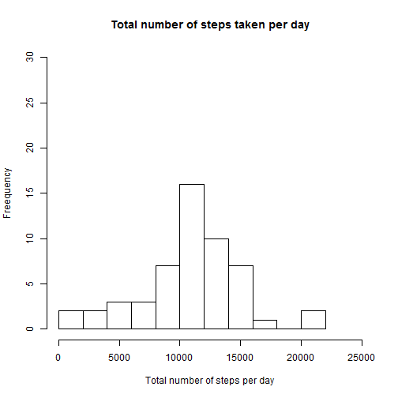
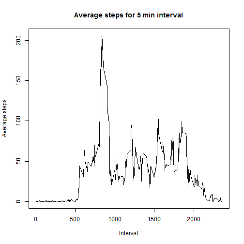
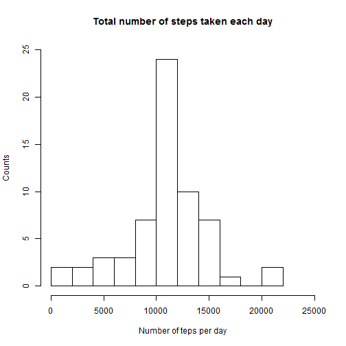
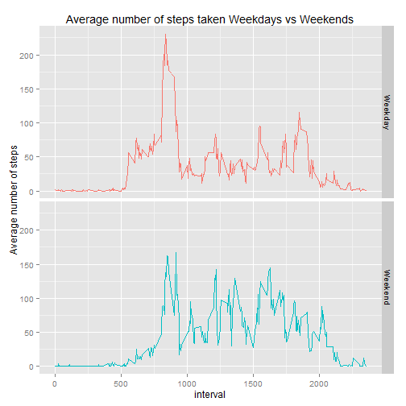

## Loading and preprocessing the data  
Show any code that is needed to  

1.  Load the data (i.e. read.csv())  

2.  Process/transform the data (if necessary) into a format suitable for your analysis  


```r
#setting working directory
setwd("C:/Data/devtools/Git/RepData_PeerAssessment1")
library(knitr)
library(ggplot2)
#suppressMessages to suppress warning/ messages
suppressMessages(library(dplyr))
#setting working directory for knit
opts_knit$set(base.dir = "C:/Data/devtools/Git/RepData_PeerAssessment1")
amdata <- NULL
#Checking for file in current directory
if(!file.exists("activity.csv"))
{
        #Extracting csv file
        unzip(zipfile = "activity.zip", file="activity.csv",exdir =".", list = FALSE)
} 

#Reading data file
amdata <- read.csv("activity.csv", header = TRUE, stringsAsFactors = FALSE, colClasses = c("numeric","character","numeric"))
#formatting date column
amdata <- mutate(amdata, date = as.Date(as.character(date), "%Y-%m-%d"))
#Activities recorded
nrow(amdata)
```

```
## [1] 17568
```

```r
#filtering NA data for steps per day calculation
stepsperday <- filter(amdata, !is.na(amdata$steps))
#filtered activities
nrow(stepsperday)
```

```
## [1] 15264
```

## What is mean total number of steps taken per day?  

1.  Calculate the total number of steps taken per day  


```r
#Grouping by day, sum of steps, and adding a column
stepcountsdata <- stepsperday %>% group_by(date) %>% summarize(stepscount=sum(steps))
#first 3 days count
head(stepcountsdata, 3)
```

```
## Source: local data frame [3 x 2]
## 
##         date stepscount
##       (date)      (dbl)
## 1 2012-10-02        126
## 2 2012-10-03      11352
## 3 2012-10-04      12116
```


2.  Make a histogram of the total number of steps taken each day  


```r
#histogram
hist(stepcountsdata$stepscount,breaks = 10, main="Total number of steps taken per day", xlab = "Total number of steps per day", ylab="Freequency", xlim =c(0, 25000), ylim = c(0, 30))
```

 

3.  Calculate and report the mean and median of the total number of steps taken per day   


```r
#summarizing data
summary(stepcountsdata$stepscount)
```

```
##    Min. 1st Qu.  Median    Mean 3rd Qu.    Max. 
##      41    8841   10760   10770   13290   21190
```

```r
stpsmean <- mean(stepcountsdata$stepscount)
stpsmedian <- median(stepcountsdata$stepscount)
```

The mean total number of steps taken per day: **10766.19** and the median total:**10765.00**

## What is the average daily activity pattern?  
1.  Make a time series plot (i.e. type = "l") of the 5-minute interval (x-axis) and the average number of steps taken, averaged across all days (y-axis)  


```r
avgsteps <- aggregate(steps ~ interval, data = amdata, mean)

plot(avgsteps$interval, avgsteps$steps, type = "l", main = "Average steps for 5 min interval", 
     xlab = "Interval", ylab = "Average steps")
```

 

2.  Which 5-minute interval, on average across all the days in the dataset, contains the maximum number of steps?  


```r
max5minavg <- which.max(avgsteps$steps)
max5minavgval <- avgsteps[which.max(avgsteps$steps), 1]
```

**5-minute interval [104] has maximum number of steps:835**

## Imputing missing values  

Note that there are a number of days/intervals where there are missing values (coded as NA). The presence of missing days may introduce bias into some calculations or summaries of the data.  

1.  Calculate and report the total number of missing values in the dataset (i.e. the total number of rows with NAs)  


```r
# NA values count for steps
nasum <- sum(is.na(amdata$steps))
```
**Total number of missing values in the dataset (number of rows with NA): 2304 ** 

2.   a strategy for filling in all of the missing values in the dataset. The strategy does not need to be sophisticated. For example, you could use the mean/median for that day, or the mean for that 5-minute interval, etc.  

3.  Create a new dataset that is equal to the original dataset but with the missing data filled in.  


```r
#Merge master data with avegrate steps data (replacing NA values) and sorting by date, interval
mrgdata <- merge(amdata, avgsteps, by = "interval", all = FALSE) %>% arrange(date, interval)
#finding NA clumns index
isna <- which(is.na(mrgdata$steps.x))
#replacing Master data NA with average column count (col-2 with col-4)
mrgdata[isna, 2] <- mrgdata[isna, 4]
#re-arrange columns as master data - steps, date, interval (eleminate col-4)
mrgdata <- mrgdata[, c(2, 3, 1)]
#head(mrgdata)
```

4.  Make a histogram of the total number of steps taken each day and Calculate and report the mean and median total number of steps taken per day. Do these values differ from the estimates from the first part of the assignment? What is the impact of imputing missing data on the estimates of the total daily number of steps?  


```r
mrgsum <- aggregate(steps.x ~ date, data = mrgdata, sum)
hist(mrgsum$steps.x, breaks = 10, main = "Total number of steps taken each day", ylab=" Counts ", xlab = "Number of teps per day",xlim =c(0, 25000), ylim = c(0, 25))
```

 

```r
#summary of meged data
summary(mrgsum$steps.x)
```

```
##    Min. 1st Qu.  Median    Mean 3rd Qu.    Max. 
##      41    9819   10770   10770   12810   21190
```

```r
#summary of step-1 data
summary(stepcountsdata$steps)
```

```
##    Min. 1st Qu.  Median    Mean 3rd Qu.    Max. 
##      41    8841   10760   10770   13290   21190
```

```r
#mean
mnsteps <- mean(mrgsum$steps.x)
#mean difference 
mnsteps - mean(stepcountsdata$steps)
```

```
## [1] 0
```

```r
#median
mdsteps <- median(mrgsum$steps.x)
#median difference
mdsteps - median(stepcountsdata$steps)
```

```
## [1] 1.188679
```

**The mean total number of steps per day: 10766.19 and the median total number of steps per day: 10766.19 **  

Do these values differ from the estimates from the first part of the assignment? **Yes**  
What is the impact of imputing missing data on the estimates of the total daily number of steps?   
**Them Mean total number of steps are same with slight difference in Median **


## Are there differences in activity patterns between weekdays and weekends?  

For this part the weekdays() function may be of some help here. Use the dataset with the filled-in missing values for this part.  

1.  Create a new factor variable in the dataset with two levels - "weekday" and "weekend" indicating whether a given date is a weekday or weekend day.  


```r
#adding a column to data frame with day string
wdnddata <- mutate(mrgdata, day = weekdays(date))
#updating day column with weekday or weekend by day string
wdnddata$day <- ifelse((wdnddata$day == "Saturday") | (wdnddata$day == "Sunday"), "Weekend", "Weekday")
```

2.  Make a panel plot containing a time series plot (i.e. type = "l") of the 5-minute interval (x-axis) and the average number of steps taken, averaged across all weekday days or weekend days (y-axis). See the README file in the GitHub repository to see an example of what this plot should look like using simulated data.  


```r
#Average number of steps
wkdendmean <- aggregate(steps.x ~ interval + day, data = wdnddata, mean)
#updating column name
names(wkdendmean)[3] <- "stepsmn"
#head(wkdendmean)
#qplot(interval, stepsmn, data=wkdendmean, type="l", geom="line",xlab="Interval", ylab="Average number of steps)",
#      main="Average steps taken Weekends vs. Weekdays", facets =day ~ .)
g <- ggplot(wkdendmean, aes(x = interval, y = stepsmn, group = day)) + geom_line(aes(colour = day)) + ylab('Average number of steps') + ggtitle('Average number of steps taken Weekdays vs Weekends') + geom_line(aes(colour = day)) +
        facet_grid(day ~ .) + theme(legend.position = "none")
print(g)
```

 

*Execute below script in commandline (or R console) to generate plot images and place them in './figure' folder  
knit2html("PA1_template.Rmd", "PA1_template.html")*  

